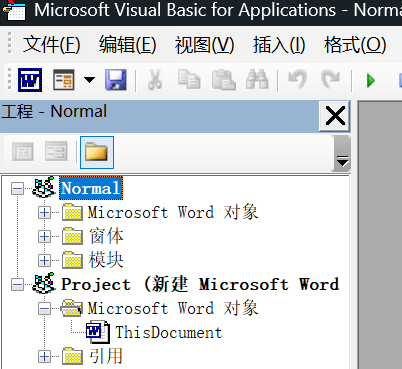
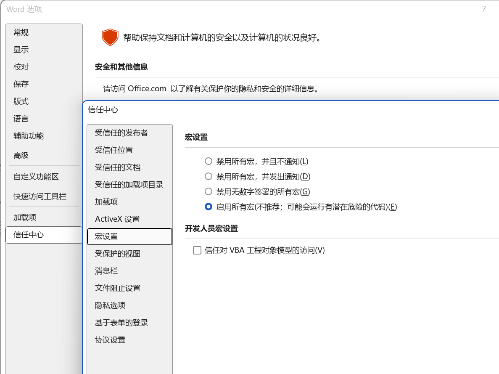
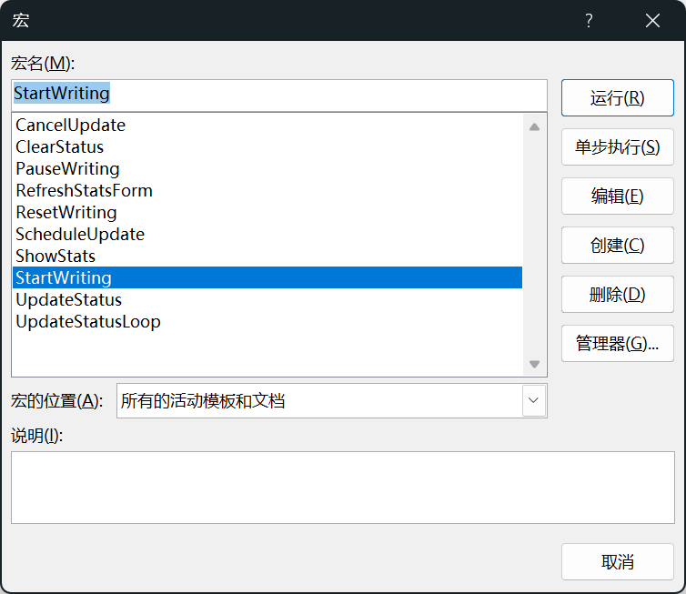
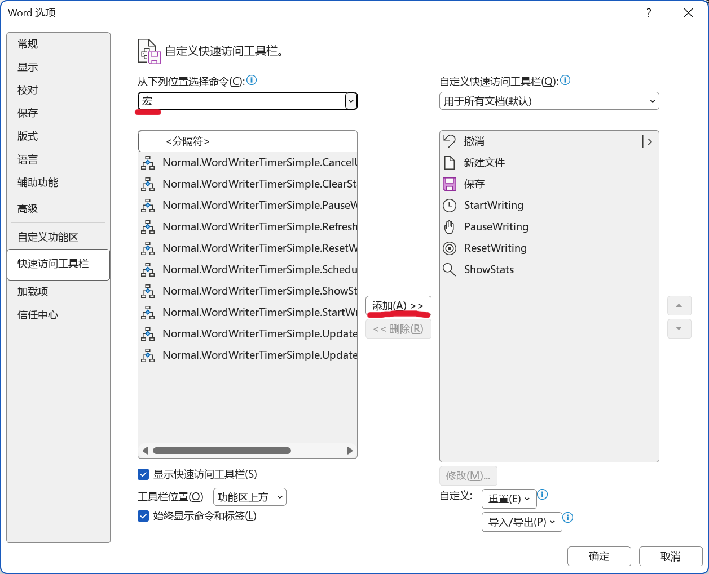
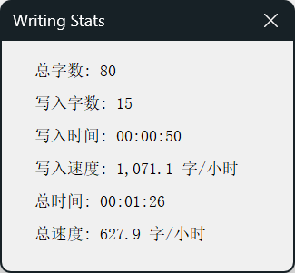

# Word 码字计时插件

适用于 Microsoft Word 2021 / 2019 / 2016 / Microsoft 365 的 VBA 宏插件。


## 功能

- **总字数**：文档当前总字数
- **写入字数**：从开始计时起的净增字数（粘贴计入，删除扣除）
- **写入时间**：实际用于写作的时间（暂停不计）
- **写入速度**：按写入时间计算的码字速率（字/小时）
- **总时间**：从开始计时起的总耗时（暂停也计时）
- **总速度**：按总时间计算的码字速率

## 文件说明

```
WordWriterTimer/
├── WordWriterTimer.bas        # 核心宏代码
├── frmStatsSimple_Code.txt    # 浮动统计窗体代码
└── README.md                  # 使用说明
```

## 环境要求

- Windows 10 / 11
- Microsoft Word 桌面版（2021 / 2019 / 2016 / Microsoft 365）
- 启用宏功能

## 安装步骤

### 1. 打开 VBA 编辑器

1. 打开 Word，新建一个空白文档。
2. 按 **Alt + F11** 打开 VBA 编辑器。



> 如果 `Alt + F11` 没反应，可能是因为笔记本电脑需要按 **Fn + Alt + F11**，或者通过菜单打开：
> **文件 → 选项 → 自定义功能区 → 勾选“开发工具” → 确定 → 点击“开发工具”选项卡 → Visual Basic**

### 2. 导入宏代码

1. 在 VBA 编辑器中，点击 **文件 → 导入文件**。
2. 选择 `WordWriterTimer.bas`。
3. 导入后，左侧“工程资源管理器”应显示：
   ```
   Normal
   └── 模块
       └── WordWriterTimer
   ```

### 3. 创建浮动统计窗体（可选）

如果只需要底部状态栏显示，可以跳过这一步。

1. 点击 **插入 → 用户窗体**。
2. 选中窗体，按 **F4** 打开属性窗口。
3. 将 `(Name)` 改为 `frmStatsSimple`，`Caption` 改为 `码字统计`。
4. 从工具箱拖入 **6 个 Label**，从上到下排列。
5. 逐个选中 Label，设置属性：

   | (Name) | Caption |
   |--------|---------|
   | `lblTotal` | `总字数: 0` |
   | `lblNet` | `写入字数: 0` |
   | `lblWriteTime` | `写入时间: 00:00:00` |
   | `lblWriteSpeed` | `写入速度: 0 字/小时` |
   | `lblTime` | `总时间: 00:00:00` |
   | `lblSpeed` | `总速度: 0 字/小时` |

6. 双击窗体空白处，删除原有代码，粘贴 `frmStatsSimple_Code.txt` 中的内容。
7. 按 **Ctrl + S** 保存。

### 4. 保存到 Normal 模板

1. 按 **Ctrl + S** 保存。
2. 如果提示只读，关闭 Word 并以管理员身份重新打开，再保存。

保存到 `Normal.dotm` 后，**这台电脑上所有 Word 文档都能使用此插件**。

### 5. 启用宏

1. 关闭 VBA 编辑器，回到 Word。
2. **文件 → 选项 → 信任中心 → 信任中心设置 → 宏设置**。
3. 选择 **启用所有宏**（测试用），或 **禁用所有宏，并发出通知**（推荐长期使用）。

   

4. 点击确定，**重启 Word**。

## 使用方法

### 运行宏

1. 按 **Alt + F8** 打开宏对话框。
2. 选择 `StartWriting`，点击运行。
3. 观察 Word 底部状态栏的统计信息。



### 常用宏

| 宏名 | 功能 |
|------|------|
| `StartWriting` | 开始/继续计时 |
| `PauseWriting` | 暂停计时 |
| `ResetWriting` | 重置计时 |
| `ShowStats` | 显示浮动统计窗口 |
| `ClearStatus` | 清除状态栏 |

### 添加到快速访问工具栏

1. **文件 → 选项 → 快速访问工具栏**。
2. “从下列位置选择命令”选择 **宏**。
3. 添加 `StartWriting`、`PauseWriting`、`ResetWriting`、`ShowStats`。
4. 点击每个宏的 **修改**，选择图标和显示名称。
5. 点击确定。

   

### 设置快捷键

1. **文件 → 选项 → 自定义功能区 → 键盘快捷方式：自定义**。
2. 类别选择 **宏**。
3. 推荐快捷键：
   - `StartWriting`：`Ctrl + Shift + S`
   - `PauseWriting`：`Ctrl + Shift + P`
   - `ResetWriting`：`Ctrl + Shift + R`
   - `ShowStats`：`Ctrl + Shift + W`

## 状态栏显示示例

```
总字数:1234 | 写入字数:567 | 写入时间:00:10:00 | 写入速度:3,402.0 | 总时间:00:15:00 | 总速度:2,268.0字/小时
```

## 浮动窗口

运行 `ShowStats` 后，会显示一个不影响打字的浮动统计窗口：



## 卸载

1. 按 **Alt + F11** 进入 VBA 编辑器。
2. 展开 `Normal` → `模块`。
3. 右键 `WordWriterTimer` → **移除**。
4. 如果有 `frmStatsSimple` 窗体，也一并移除。
5. 按 **Ctrl + S** 保存。


## 许可

本插件为个人使用创建，可自由修改和分享。
